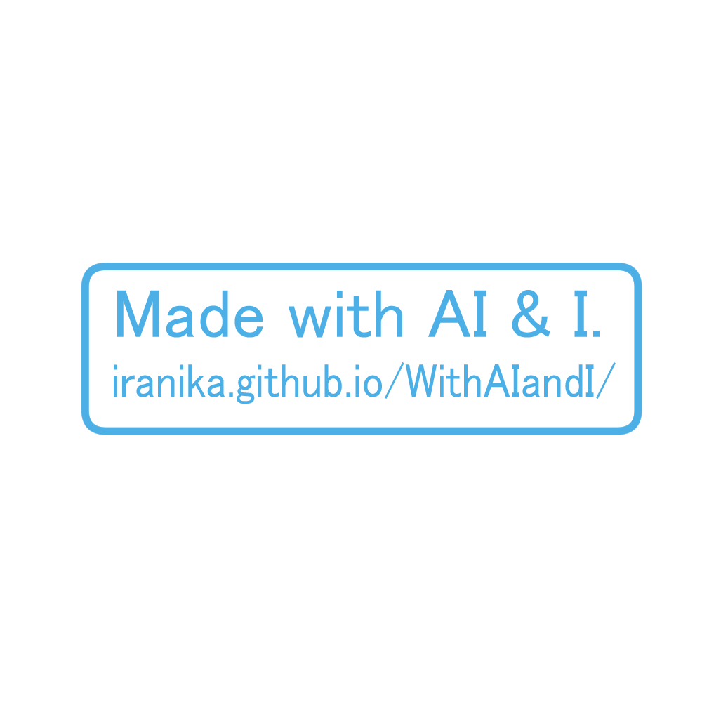
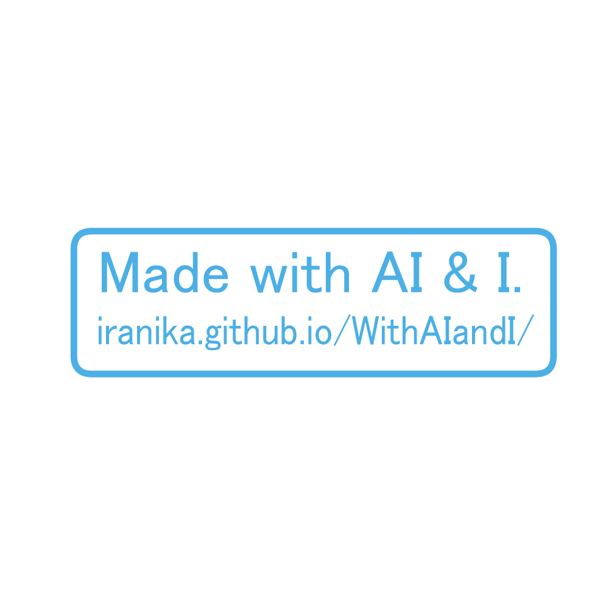
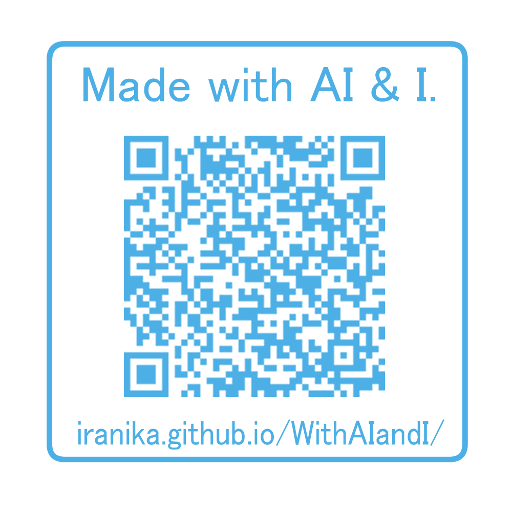
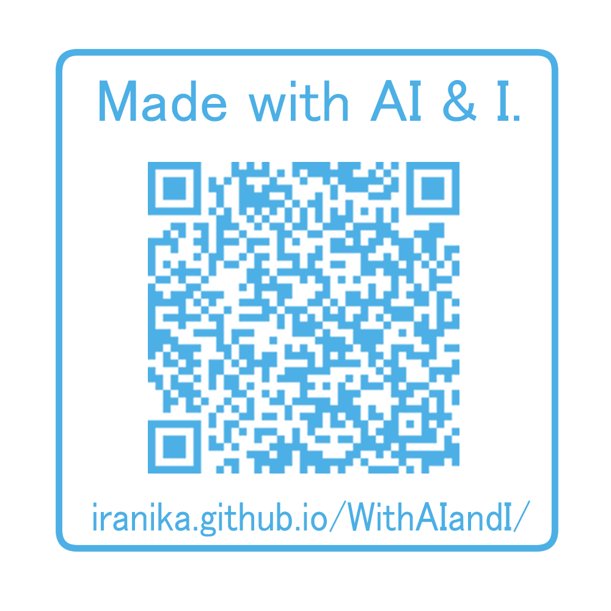

# With AI & I 

## 目的

With AI & I（WAII)は創作にAIが寄与したことを明示するためのものです。  
WAIIは何かしらの拘束力や免除の効力を持つものでもはありません。  

AIが創作に寄与したことを明示することで、消費者（鑑賞者）の誤解を避けることを目的としています。  
創作にAIが寄与した割合に関係なく、`AIと共に創作したことを表明したい`という意図で使ってOKです。

WAIIにおける`AIの創作への寄与`は日本国の法令における定義ではなく明示する各々の主観です。  
WAIIは、AIが寄与した創作を示すための公共性のあるマークが生まれるまでの暫定的な処置です。

もしWAIIを活用することに関して疑問などがあればissueで質問してください。

## 透かしの利用に関して

公開しているWAIIの透かし画像などは自由に改変して利用してOKです。  
ただし、AIが寄与したことを示すために`With AI & I`の文字は記載するようにしてください（大文字小文字は問いません）  
そして、なるべくこのサイトへのリンクをQRで埋め込むかアドレスを記載してください。  

また、WAIIは明示することが目的です。透かしを気づきにくい位置に配置することは極力避けてください。  
透かしの推奨位置は次のとおりです。

1. 画像の右下付近
2. 画像の四隅

透かしの透明度に関しては、透明度15%以上を推奨しています。

だたし、上記の位置と透明度の推奨に関してはあくまで推奨です。  
自己の判断で無視しても構いません。

